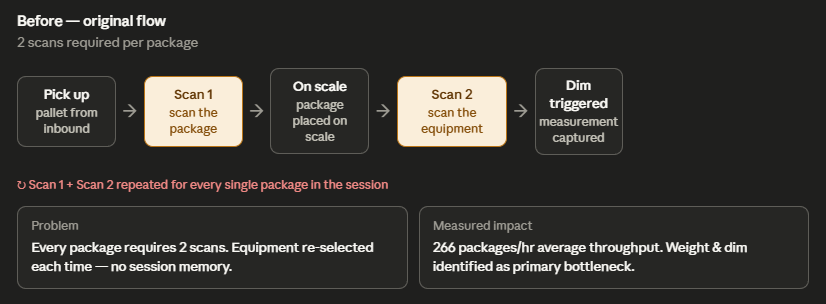
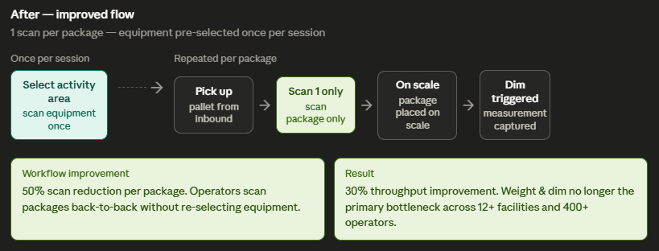
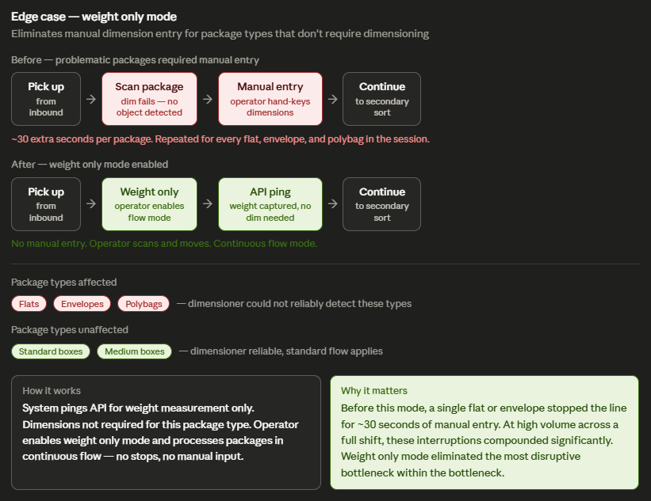

# Sortation Platform

**Role:** Product Manager  
**Scope:** Multi-facility parcel sortation platform used by 400+ operators across 12+ facilities  
**Outcome:** 30% throughput improvement at the primary bottleneck stage

---

## The problem

The weight and dim station was the first scan any package received — and the biggest bottleneck in the entire sortation process. Every package had to pass through it before moving to secondary sort.

Two things made this hard to solve:

**No throughput metrics existed.** Field observations confirmed operators had no visibility into their own performance. There was no way to measure how many packages per hour each station was processing — which meant there was no way to know if changes were working.

**The root cause was unclear.** Potential explanations included system latency, unclear UI feedback, and overly complex workflows. Without isolating the real constraint, any engineering effort risked targeting the wrong layer.

---

## Discovery

**Field observations** were conducted at facilities selected to represent different operational profiles — different volumes, different package mixes, different operator configurations.

**Operator feedback** was gathered from operations managers across the network. Key themes surfaced consistently: the scanning sequence felt repetitive, problematic package types caused unpredictable stops, and operators had no visibility into their own throughput.

**SQL analysis** of scan event data was used to quantify what field observations suggested. Dwell time queries using window functions revealed time-between-stages across the sortation process — confirming that weight & dim had significantly higher dwell time than any other stage.

---

## Root cause

Two distinct bottlenecks were identified within the weight & dim station:

**1. Redundant equipment scan**  
Every package required two scans — one to identify the package, one to trigger the specific dimensioning unit. Operators were re-selecting the same equipment hundreds of times per session with no session memory.

**2. Manual dimension entry for incompatible package types**  
Flats, envelopes, and polybags regularly triggered a "No Object Detected" error. Operators had to stop and hand-key dimensions for every affected package — approximately 30 additional seconds per package, at high frequency throughout a shift.

---

## Workflow improvements

### Improvement 1 — Activity area pre-selection

Operators scan their equipment once at the start of a session to pre-select their activity area. For the remainder of the session, they scan packages only.

**Result:** 50% reduction in scans per package at the weight & dim station.

---

### Improvement 2 — Weight only mode

For package types where dimensioning is not required, operators enable weight only mode. The system captures weight via API ping only — no dimension capture, no manual entry.

**Affected package types:** Flats, envelopes, polybags — dimensioner could not reliably detect these types  
**Unaffected:** Standard and medium boxes — standard flow applies

**Result:** Eliminated the most disruptive interruption within the bottleneck. A single flat or envelope previously stopped the line for ~30 seconds of manual entry. At high volume across a full shift, these interruptions compounded significantly.

---

## Outcome

| Metric | Before | After |
|---|---|---|
| Scans per package (standard) | 2 | 1 |
| Manual entry for flats / envelopes | Required | Eliminated |
| Throughput improvement | Baseline (266 pkg/hr) | 30% increase |
| Deployment | — | 12+ facilities, 400+ operators |

---

## Artifacts in this folder

| File | What it is |
|---|---|
| `workflow-analysis/sortation-workflow-analysis.md` | Full written analysis — discovery, root cause, solutions, decisions |
| `sql-analysis/sortation-queries.sql` | 6 BigQuery SQL queries used to identify bottlenecks and validate improvements |
| `diagrams/before-flow.png` | Original 2-scan workflow |
| `diagrams/after-flow.png` | Improved 1-scan workflow with activity area pre-selection |
| `diagrams/weight-only-mode.png` | Edge case flow for package types that don't require dimensioning |

---

## SQL analysis — what the queries answer

The SQL analysis folder contains 6 queries written in Google BigQuery SQL. Each query answers a specific business question:

| Query | Business question |
|---|---|
| Q1 — Throughput by station | How many packages per hour is each station processing? |
| Q2 — Dwell time by stage | Which stage has the highest dwell time? |
| Q3 — Package type distribution | What % of volume is affected by the weight only mode improvement? |
| Q4 — Scan completion rate | Are operators completing all required scan stages? |
| Q5 — Pre/post adoption | Did operators adopt the new workflow after the release? |
| Q6 — Before/after dwell time | Did the workflow change actually reduce processing time? |

Q2 and Q6 use window functions (`LAG`) to compute time between consecutive scan events — the core analytical technique that identified the bottleneck and validated the fix.

---

## Key product decisions

**Why two separate improvements instead of one?**  
The two bottlenecks had different root causes and different solutions. Shipping them separately made it possible to isolate which change drove which outcome — and to validate each improvement independently before broader rollout.

**Why weight only mode instead of auto-detection?**  
Auto-detection of package type would require additional engineering investment and introduce new failure modes. Weight only mode is operator-initiated — the operator knows the package type better than the system does. This kept the solution simple, reliable, and immediately deployable.

**Why measure at the station level?**  
No throughput metrics existed at the station level before this work. Measuring packages-per-hour per station gave operators visibility into their own performance for the first time — and gave the product team the data needed to validate that changes were working.

---

*Field research, operator feedback, and SQL analysis were conducted across sortation facilities. Facility names and operator identifying information are not included.*
